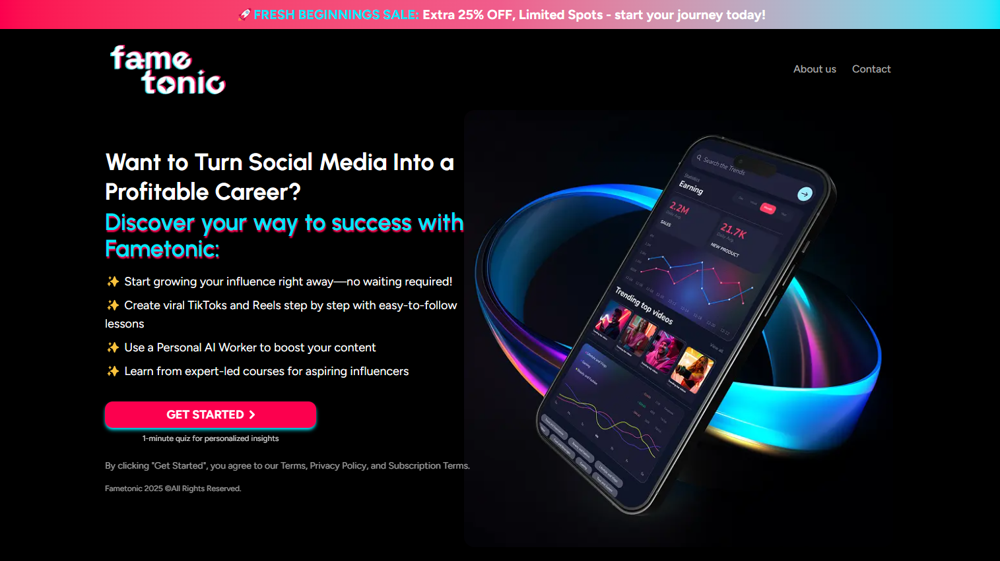

# 📣 Fametonic Landing Page – NetZet Task Submission

A fully responsive landing page built with **Next.js 15 (App Router)**, **TypeScript** and **Tailwind CSS**, based on the provided Figma design. This project is submitted as part of the frontend development task for the NetZet hiring process.

---

## 🔗 Live Demo

🚀 **[Click here to view the deployed app](https://fame-tonic-sigma.vercel.app/)**  
📦 **[Public GitHub Repo](https://github.com/SakifKhan98/netzet-demo)**

---

## 🖼️ Screenshot

  
<sub>A responsive hero section with mobile and desktop views following the Figma mockup.</sub>

---

## ✨ Assigned Features Implemented

| Feature                  | Description                                                           |
| ------------------------ | --------------------------------------------------------------------- |
| ✅ **Responsive Design** | Full mobile → desktop responsiveness using Tailwind's utility classes |
| ✅ **Navigation Bar**    | A responsive navbar with links and mobile hamburger menu              |
| ✅ **Animated CTA**      | Pulsing, animated call-to-action button with hover arrow              |
| ✅ **Hero Section**      | Split layout hero with custom image and text blocks                   |
| ✅ **Gradient Banner**   | A promotional banner at the top with brand-aligned gradient           |

---

## 💡 Extra Features Implemented

| Feature                  | Description                                                                                                                |
| ------------------------ | -------------------------------------------------------------------------------------------------------------------------- |
| ✅ **Actionable CTA**    | Get Started Button will take to a Simple Signup Page                                                                       |
| ✅ **About us Page**     | Clicking About us takes to a simple about Page                                                                             |
| ✅ **Contact Page**      | Implemented a Contact page with a simple dummy form                                                                        |
| ✅ **Global Error Page** | Styled error boundary using `app/gloabal-error.tsx`. Custom error page is implemented for end user                         |
| ✅ **Custom 404 Page**   | Fallback route using `app/not-found.tsx`                                                                                   |
| ✅ **Loading Overlay**   | Full-screen spinner during lazy loading states. Intentionally added a delay in the home page to show the `Loading Spinner` |
| ✅ **Font Integration**  | Custom font setup for consistency                                                                                          |

---

## 🛠️ Tech Stack

- [Next.js 15 (App Router)](https://nextjs.org/docs/app)
- [Tailwind CSS v4 (Preview)](https://tailwindcss.com/)
- TypeScript

---

<!-- ## 📁 Project Structure -->

## 🚧 Challenges Faced

- **Exact Gradient Color Matching**: Picking the exact gradient colors from Figma was tricky. I tried to go as close as possible, but some colors/styles might be slightly off.
- **Banner Visibility During Loading**: I did not want to show the banner during loading. So, I had to bring styling out of `page.tsx` to `layout.tsx`.
- **Font Integration**: As the `TailwindCSS V4` does not have `tailwind.config.js` file, it was a bit tricky at first to integrate the necessary fonts. But later I successfully used `next/font` to integrate the fonts.
- **Sharp Gradient Edges**: Tailwind’s built-in gradients were too smooth for the brand design, so I used utilities of tailwind CSS to create sharper transitions.
- **Making Pixel Perfect and Responsive**: It was a bit challenging to make the design pixel-perfect, especially with the hero section and the gradient banner. I tried my best to match the design as closely as possible, but some elements may not be 100% identical. Moreover, I did a mistake, I did not notice my browser was in `125% zoom` mode, so I had to re-calibrate the design to match the Figma design.

---

## 🔧 What Can Be Improved

- **Responsiveness**: Responsive design can be improved further, especially for larger screens.
- **Unit Testing**: We can integrate basic unit tests with Cypres or Jest or Vitest.
- **Better Lazy Loading**: We can load heavy assets (e.g., images) using optimized strategies.
- **Better Gradient**: Gradient Colors can be imrpoved more.
- **Functional Forms**: `signup` and `contact` forms can be made functional with backend integration.
- **Dark Mode Support**: We can add a dark/light toggle switch using Tailwind’s `dark` variant.
- **SEO Optimization**: We can add meta tags and improve SEO for better visibility.

---

## 📝 Installation

One should follow the steps below to clone the project, run it locally, build it for production, and deploy it.

### 🚀 1. Clone the Repository

```bash
git clone https://github.com/your-username/fametonic-landing.git
cd fametonic-landing
```

### 📦 2. Install Dependencies

```bash
npm install
# or
yarn install
# or
pnpm install
```

### 🔧 3. Run the Development Server

```bash
npm run dev
# or
yarn dev
# or
pnpm dev
```

Open [http://localhost:3000](http://localhost:3000) with your browser to see the result.

### 📦 4. Build for Production

```bash
npm run build
# or
yarn build
# or
pnpm build
```

### 🚀 5. Start the Production Server

```bash
npm start
# or
yarn start
# or
pnpm start
```

Open [http://localhost:3000](http://localhost:3000) with your browser to see the result.

### 📦 6. Deploy to Vercel

You can follow the instructions on [NextJS's Deployment documentation](https://nextjs.org/docs/app/building-your-application/deploying) to deploy your Next.js app.

---

## 📬 Contact

If you have any questions or feedback, feel free to reach out via [LinkedIn](https://www.linkedin.com/in/sakifKhan/) or [Email](mailto:sakifkhan98@gmail.com).
